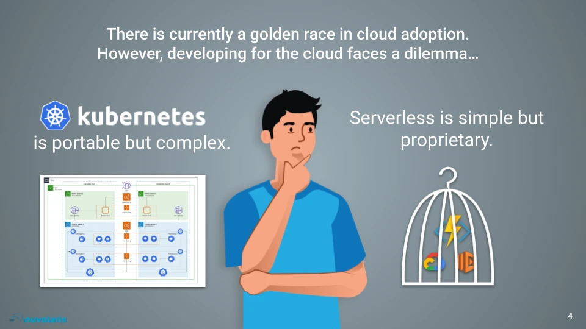

The dilemma everyone who wants to develop cloud-native applications faces today is: should I choose Serverless or Kubernetes?

Serverless offers a gentle introduction to the cloud. You just need to write your code, send to the cloud and it will run automagically. The cloud provides all the services you need including automated scaling.

However serverless today means vendor-lockin. You have to adopt and build your applications on top of the services of a single cloud provider. So your are building your house on a leased land.

Because vendor lock-in is not acceptable for any forward-looking business, today most of them avoid serverless and go after the most widely used multi-cloud solution: Kubernetes.

However Kubernetes comes with a significant burden of complexity. It is both bare bone and rich of different plugins so you have to configure and deploy a lot of services on it. It can take months before it is ready to be used.

What in the end businesses need is the productivity of Serveless with the control of environments and deployments granted by Kubernetes. This is the problem that Nuvolaris wants to solve.
