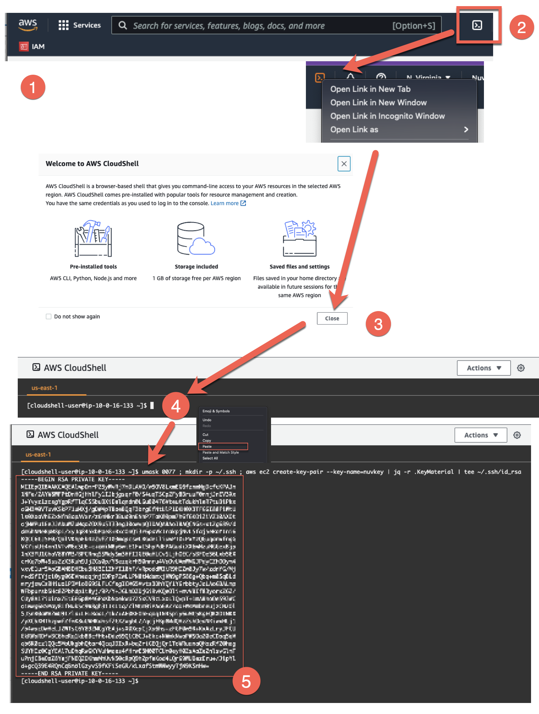
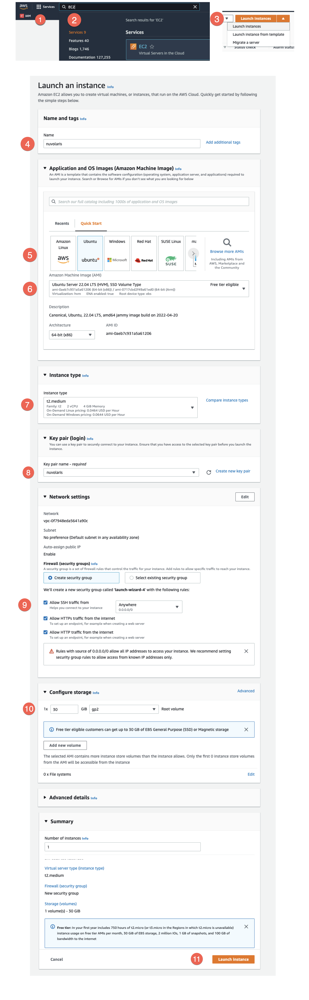
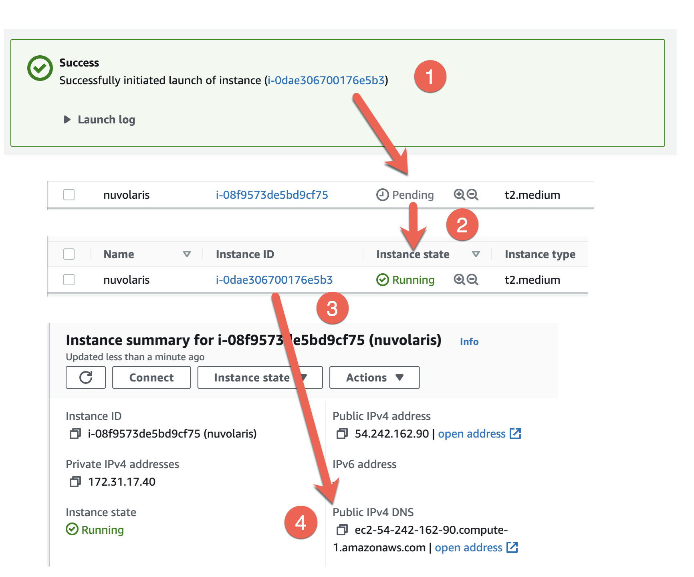

# Install on an AWS EC2 Instance

You can install Nuvolaris on a single EC2 Instance.

You need to create an instance with at least 4GB, 30GB disk space and 2 VCPU. You also need to perform some operations on the command line, even if you do not need to be or become familiar with it.

As a prerequisite, you need to get access to the AWS Console by registering to Amazon Web Services.

You can then use the following procedure to setup Nuvolaris.

## Generate an ssh key

Once you got access to the console, as a first step open a CloudShell and create a key to access the instance, as follows:



1. Log into the AWS Console

2. Locate the icon to open the CloudShell and open in in a new tab (so you do not have to close it). If you use Chrome, you can right clik on the icon and select "Open Link in new tab".

3. Close the welcome screen.

4. You get there a command line where you can type commands. Copy the following text and paste in the CloudShell. If you use Chrome, you can right click on the dark area on the screen and select Paste.

```
umask 0077 ; mkdir ~/.ssh ; aws ec2 create-key-pair --key-name=nuvkey | jq -r .KeyMaterial | tee ~/.ssh/id_rsa
```

5. The command will show your private key. Select it, copy it on the clipboard, then paste in a file in your computer or in a password manager. You will need it to access again your virtual machine if needed.

**WARNING** If you lose the private key, you will be unable to access again any virtual mahine you will created with this key. There is no way to show again this file.

## Launch the EC2 Virtual Machine

Now you can create a virtual machine and access it with the cloud shell. You should switch back to the initial tab (do not close the console) and launch a virtual machine as follows:



1. Click on the Services icon.
2. Type `EC2` to find the EC2 service and click on the EC2 link.
3. Find the `Launch Instance` pull down, open it and click on `Launch Instances`. Then fill the form that shows up as follows.
4. Specify the name of the instance.
5. Select Ubuntu as the Image type to launch.
6. Select Ubuntu Server, at least 22.x or 20.x. We recommend you pick AMD64 as an architecture, for now.
7. Select an instance with at least 4GB of memory and 2VCPU. Suggested choice is `t2.medium`. Larger VM types are ok, smaller are not.
8. Specify the key pair you want to use. This step is required to be able to access the instance. If you created a key you should see `nuvkey` as an option, select it.
9. Here you need to allow traffic for SSH, HTTP and HTTPS.
10. Here you need at least 30Gb of disk space.
11. If you filled all the previous fields, you are ready and you can click here to Launch the instance.

Once the instance is up and running, the following screen will pop up:



1. Click on the link corresponding to the instance
2. You will see your virtual machine, with the state `Pending`. Wait until it is `Running` (you may need to refresh the page a few times)
3. Click on the link of your virtual machine again to see the details.
4. Follow the link, opening the instance details, find out the `<public-ipv4-dns>, and copy it in the clipboard

Now, switch back to the CloudShell tab you opened before and type

```
ssh ubuntu@<public-ipv4-dns>
```

Replace the `<public-ipv4-dns>` with the value you pasted.

If everything it is ok it will try to connect to your virtual machine and ask for confirmation. Type `yes` and you will be into the virtual machine you just created.

## Install Nuvolaris

Once you are connected to the virtual machine, you can install Nuvolaris executing the following command:

```
curl -s https://www.nuvolaris.io/scripts/ubuntu-ec2.sh | sudo bash
```

The script will take a while to install Kubernetes and Nuvolaris.

If everything goes ok, at the end it will show a command like this:

```
nuv wskprops --apihost=<apihost> --auth=<auth>
```

where `<apihost>` is the DNS name of your virtual machine and `<auth>` is the authorization key.

Take note of this command. You will need it to configure access to your serverless environemnt from anywhere.

### Access to Nuvolaris from your computer

You can then install the `nuv` command in your favorite client machine, [downloading](/download) the version that matches you client.

You have to execute the command shown at the end of the installation to connect to your instance.

To check if it is working, try to run:

```
nuv wsk action list
```

You should see the action `/nuvolaris/hello` in the output.

Once the installation is completed, proceed reading [Apache OpenWhisk documentation](https://openwhisk.apache.org/documentation.html), remembering to use `nuv wsk` when you see `wsk`.

If something goes wrong, please check the [troubleshooting](/documentation/troubleshooting) page.
